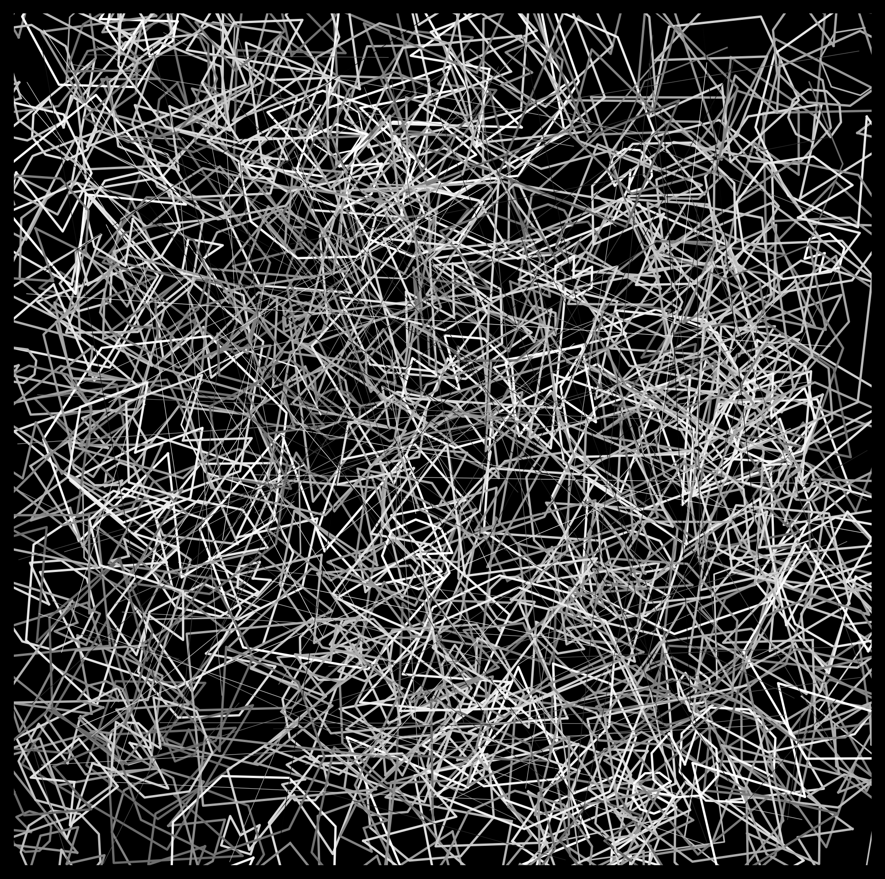
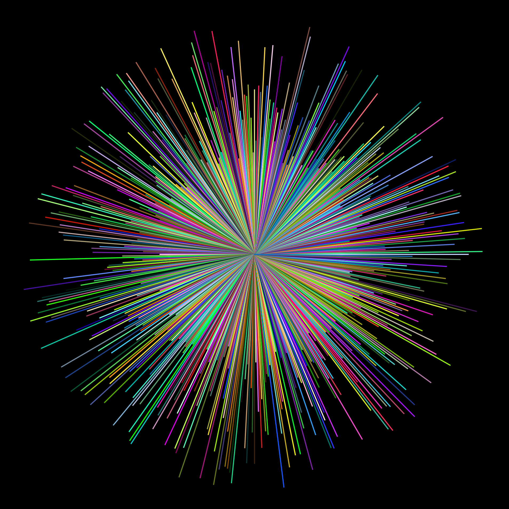
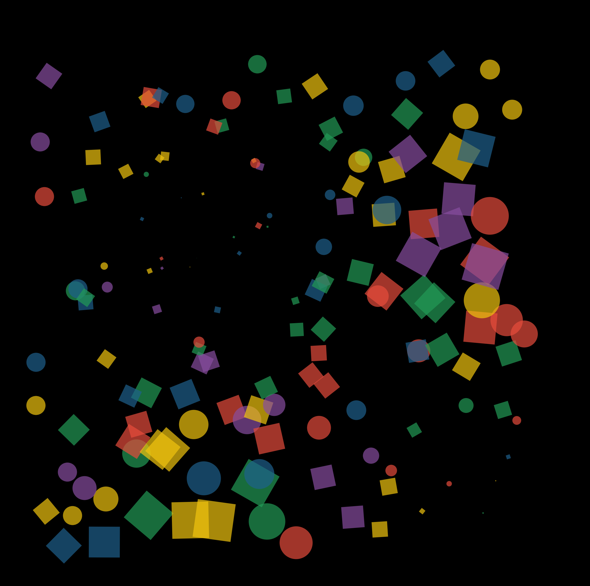
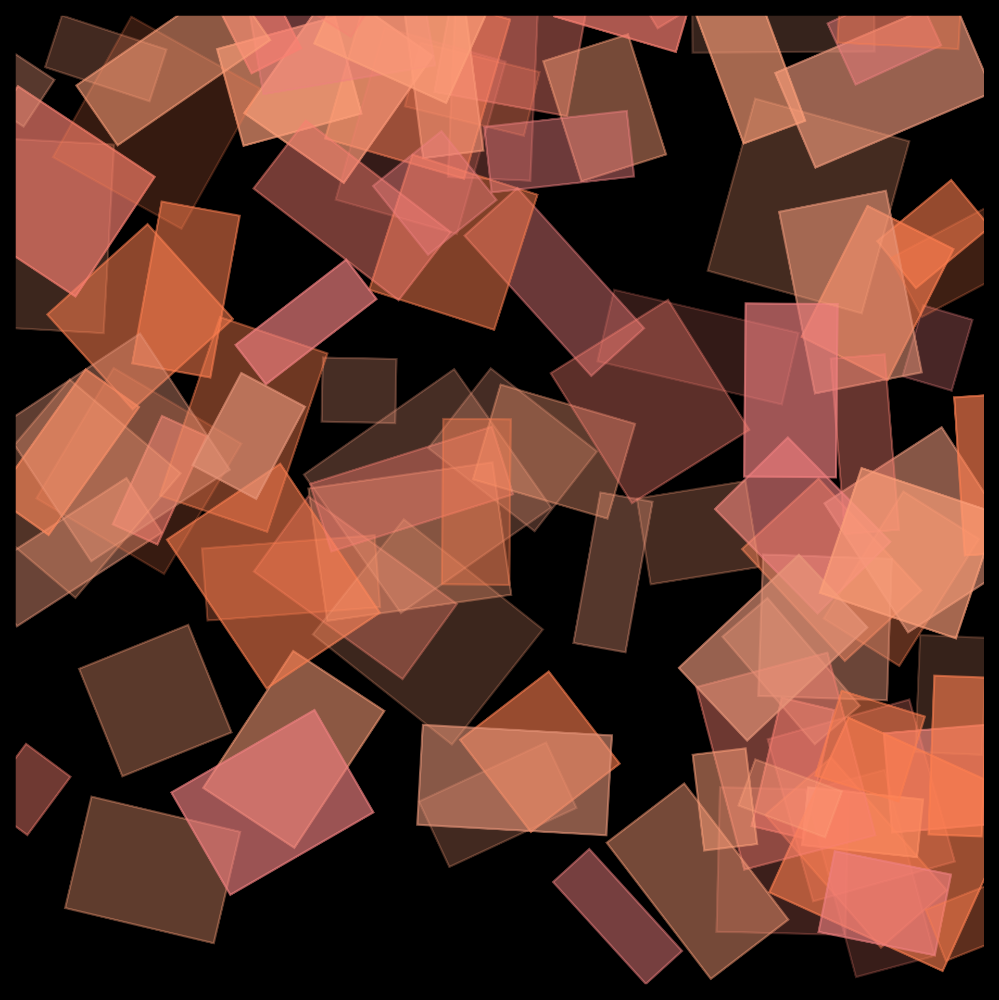
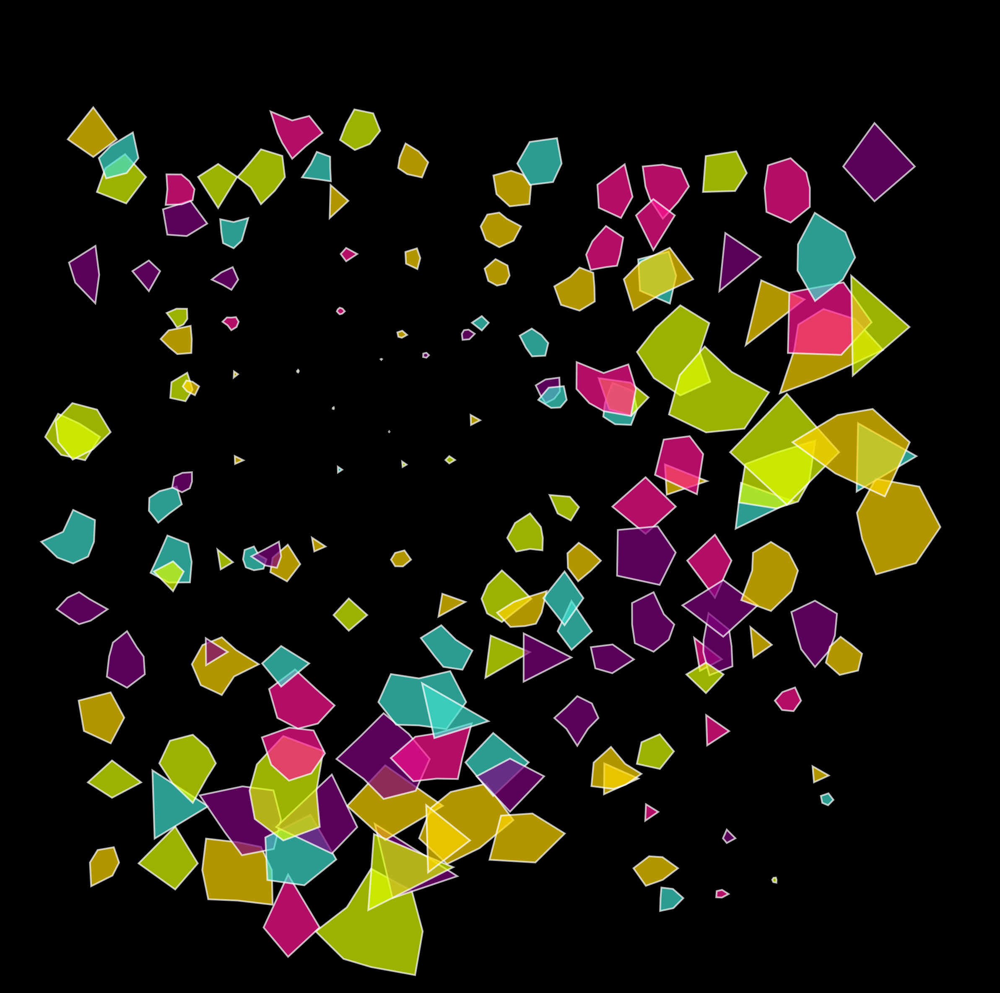

# Arthurian

This was inspired by images contributed to bluesky by 
- @shurastei.bsky.social
- @jeffpalmer.bsky.social
- @pb67art.bsky.social
- @whitekoalaart.bsky.social

## Description

Arthurian is a basic art generation tool that creates abstract compositions using different geometric patterns and styles. This is largely a learning exercise for me. I have seen very interesting art on Bluesky recently and I was inspired. 

## Features

- Multiple art generation styles:
  - `noise`: Complex abstract diagrams with overlapping polygons and lines
    
  - `radial`: Evenly spaced lines radiating outward with varied colors and random lengths
    
  - `squares`: Dynamic grid patterns with randomized empty spaces and multiple color palettes
    
  - `abstract_rectangles`: Abstract compositions with overlapping semi-transparent rectangles
    
  - `irregular_polygons`: Organic mosaic patterns created with irregular polygons of varying sizes and rotations
    
- Customizable background colors using CSS color names or RGB values
- Clean, modern aesthetic with high-resolution output

## Installation

```bash
pip install -r requirements.txt
```

## Usage

Generate art using the command line interface:

```bash
python arthurian.py STYLE [options]
```

Where `STYLE` can be one of: `noise`, `radial`, `squares`, `abstract_rectangles`, or `irregular_polygons`

Options:
- `-o, --output`: Output filename (default: art.png)
- `--bg, --background`: Background color using CSS color name or RGB values (default: black)
  - CSS colors: e.g., "blue", "lemonchiffon"
  - RGB values: e.g., "255,255,255" for white

Examples:
```bash
python arthurian.py noise -o abstract_noise.png --bg white
python arthurian.py radial --background "135,206,235"
python arthurian.py squares --bg lemonchiffon -o geometric_squares.png
python arthurian.py abstract_rectangles -o layered_art.png --bg skyblue
python arthurian.py irregular_polygons --bg "124,252,0" -o organic_mosaic.png
```

## Requirements

- Python 3.7+
- matplotlib
- numpy
- Additional dependencies listed in `requirements.txt`

## Contributing

Contributions are welcome! Please feel free to submit a Pull Request.

## License

This project is licensed under the MIT License - see the LICENSE file for details.
